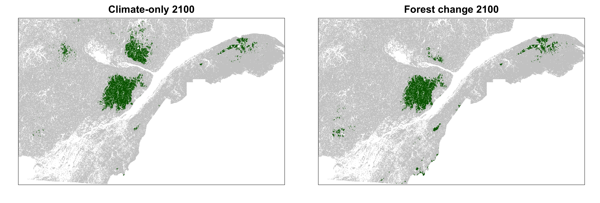

```{r setup, include=FALSE}
knitr::opts_chunk$set(
  comment = "#",
  cache = TRUE,
  collapse = TRUE,
  warning = FALSE,
  message = FALSE,
  fig.width = 7,
  fig.height = 5,
  fig.align = 'center',
  fig.retina = 3
)

options(htmltools.dir.version = FALSE)

# base plot layout
mypar = list(mar = c(3.5,4.5,1,1), mgp = c(1.5, 0.3, 0), bg="transparent", tck = -.008)

# Rscript -e "rmarkdown::render('index.Rmd')"
```

class: title-slide, middle

# Distributions are more than habitat amount

<hr width="65%" align="left" size="0.3" color="orange"></hr>

## The metapopulation structure is a vital element to distribution change

<br>
<br>
<br>

### Victor Cameron

### June 2022

<!--
<br><br>
[<i class="fa fa-github fa-lg" style="color:#e7e8e2"></i> vcameron1](https://github.com/vcameron1/Talk_STM/IBS_2022)
-->

???

- Good afternoon
- Name
- UdeS
- Subject: My talk will touch distribution changes under climate change from a regional perspective and get interested in metapopulation theory to leverage distrbution projections

---
class: corridor

.cite[[Corridor Appalachien](https://www.corridorappalachien.ca/nous-joindre/).]

???

- Moved to Sherbrooke, in southern Qc
- The region is known for the majestic automn colors
- 

---

# Non-equilibrium dynamics

## Sugar maple

.center[]

.cite[McKinney et al. [2007](https://academic.oup.com/bioscience/article/57/11/929/234249?login=true) BioScience.]

???


---

# Complexity of bottom-up systems

## The Bicknell's thrush (*Catharus Bicknelli*)

.pull-left[
  <br>
  <br>
  .center[]]

.pull-right[
  <br>
  <br>
  <br>
  Threathened in Canada

  Specialist of cold, high elevation Balsam fir forests

  Patchy distribution
]


???

Non-equilibrium dynamics makes it very complex to predict the effect on intracting species

BITH
A threatened bird species whose distribution is patchy and restricted to high elevation dense balsam fir forests
- Most of its canadian populations in Qc
- At risk; Extremely restricted distribution
- Climate change could pose a major threat to the persistence of this species in Canada as favourable climatic conditions within habitat patches could shrink rapidly

---
class: empty

# Regional distribution and metapopulation dynamics

.center[]

---
class: empty

# Regional distribution and metapopulation dynamics

.center[]

---
class: empty

# Regional distribution and metapopulation dynamics

.center[]

---
class: empty

# Regional distribution and metapopulation dynamics

.center[]

--

## Metapopulation dynamics
The landscape's .orange[***spatial structure***] and species .orange[***dispersal***] abilities affect .orange[***connectivity***] and .orange[***occupancy***]

???

---

# Distribution dynamics


.center[]


???

Studying BTIH dibution dynamics
- Metapopulation dynamics describe the ability of BITH to occupy suitable patches, which may be important in its response to climate change
- BITH may be *particularly vulnerable to climate change*
- I modellized BITH's favourable habitat
- I compare BITH favourable landscapes under **climate-only** change and **climate-induced forest** change scenarios

---

# Distribution dynamics

## Favorable landscape shifts predict non-equilibrium dynamics

.center[]

???

BITH : Projections main results
- **Climate shifts faster** than forest composition
- **Non-equilibroin dynamics**: **Persistence** where BITH is already present despite **less favorable conditions** (extinction debt), but **no northern-expansion** (colonization credit)

---

# Distribution dynamics

## Spatial structure is affected by climate change

<br>
.center[]

???

As the metapopulation dynamics may be important in determining distribution change to climate change, I then looked into the change in spatial structure of the favorable landscapes

**Patch area, connectivity, and habitat amount can be differently affected by climate warming**

Landscape **connectivity** was affected by newly suitable habitat patches, the extinction of the smallest habitat patches, the fragmentation of the larger ones, and the dispersal distance

---

# Distribution dynamics

## Persistence is impacted by the ability to use available habitat

<br>
.center[]

---

# Distribution dynamics

## Persistence is impacted by the ability to use available habitat

<br>
.center[]

---

# Distribution dynamics

## Persistence is impacted by the ability to use available habitat

<br>
.center[]

???

But **capacity diverges under limited dispersal**

**Persistence** could not be explained by changes in **habitat amount alone**

That is because the species’ ability to **use all available habitat** is affected by **dispersal**, which **habitat amount alone does not represent.**

---
class: inverse

# .center[Take home messages]
<html><div style='float:left'></div><hr color='#EB811B' size=1px width=720px></html>

<br>

1. Habitat mismatch affects species distribution shifts

???

The concepts developed here are **more general** than the specialist-habitat context

- BITH is likely to **persist** despite **unfavourable climatic conditions**
- **Non-equilirbium** dynamics are to be expected


--

2. Metapopulation dynamics may precipitate species decline

???

<br>

- **habitat shrinking** + **connectivity loss** = **precipitated range contraction**
- **persistence** of this species under climate change to be fundamentally affected by **metapopulation dynamics**


--

<br> <br><br>
## .large[.orange[The metapopulation structure is a vital element to distribution change]]

???

Our results support the importance of **integrating** both **habitat amount** and **landscape spatial structure** in mechanistic distribution **modelling**

---
class: inverse

# Coauthors

.pull-left[
  <br>
  ## Dominique Gravel
  Université de Sherbrooke

  ## Guillaume F. Blanchet
  Université de Sherbrooke

  ## Yan Boulanger
  Canadian Forest Service

  ## Junior Tremblay
  Natural Resources Canada
]

.pull-right[


]
