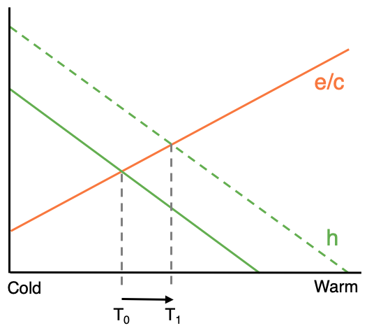
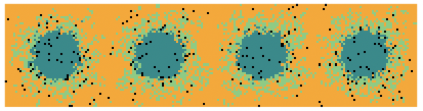
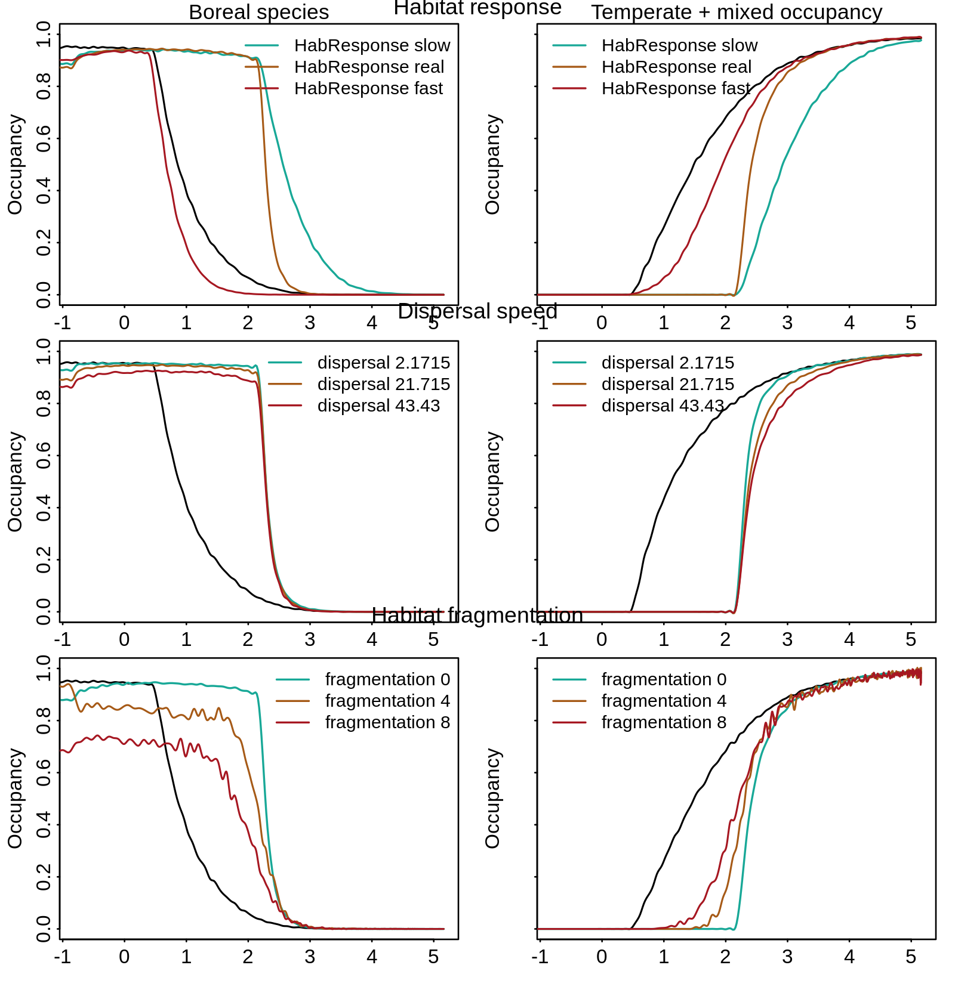

class: title-slide, middle

# Aire de distribution et changements climatiques

<hr width="65%" align="left" size="0.3" color="orange"></hr>

## Comment les interactions biotiques modulent-elles la réponse?

<br><br>
### Victor Cameron

### Novembre 2020

???

# Réponse des espèces au cc

## évaluer les effets des CC et sur l'aire de distribution en tenant compte des interactions biotiques

---


```{r setup, include=FALSE}
options(htmltools.dir.version = FALSE)
```

# Variabilité des réponses

.center[


]

???

Réponse aux cc la plus souvent rapportée: déplacement des distributions vers les pôles et altitudes

Le déplacement des distributions est souvent raportée comme coincidant avec des changements abiotique de l'environnement aux limites de distribution
  - Cela a entrainé un fort intérêt pour la compréhension des méchanismes qui limitent la distribution des espèces 
  - Des études récentes ont souligné l'importance des interactions biotiques (wisz_role_2013)

## Grande variabilité dans la réponse des distribution: les facteurs abiotiques n'expliquent complètement les déplacements de distribution (freeman_expanding_2018)

Pour comprendre la réponse des espèces aux cc, compréhension des effets des interactions sur les RL et leur réponse aux cc.

---

# Système utilisateur-habitat

## Les arbres n'arrivent pas à suivre le rythme du réchauffement climatique

.center[

]

.cite[Talluto et al. [2017](https://www.nature.com/articles/s41559-017-0182) Nat. Ecol. Evol.]

???

## Les habitats forestiers prennent du retard sur le réchauffement climatique

---

# Système utilisateur-habitat

## Les passereaux sont mobiles, mais limités par leur habitat

.pull-left[
<br>
La théorie des métapopulations définie la limite de distribution à l'équilibre comme un équilibre des processus d'extinction et de colonisation

$$h(T^{*}) > \frac{e(T^{*})}{c(T^{*})}$$
]

.pull-right[
<br>
.center[]
]

???

La réponse de certaines espèces pour les quelles les arbres constituent leur habitat pourrait être modifée

Ce qui est interessent, c'est que l'habitat et l'espèce répondent différemment aux cc. 

## Ce système permet d'évaluer l'effet des interactions sur la réponse des espèces aux cc.

---

class: inverse, center, middle

# Quels sont les effets combinés des changements climatiques et de la disponibilité d'habitat sur l'aire de distribution?

<html><div style='float:left'></div><hr color='#EB811B' size=1px width=720px></html> 

## 1- Quel est l'impact de la vitesse de réponse de l'habitat sur la réponse de l'espèce?

## 2- Est-ce que la réponse est spécifique à l'espèce?

???

# Pour comprendre la réponse des espèce aux cc

Il faut comprendre les effets combinés des cc et des interactions sur l'aire de distribution

J'évalue les changements d'aire de distribution en réponse au climat et à la disponibilité d'habitat par une étude de simulation utilisant un modèle de métapop

J'explore 4 scénarios pour des traits fonctionnels et des structures d'habitat différents.

---

# Modèle probabilistique

Le Modèle est un un processus markovien qui défini les dynamiques de présence-absence d'une espèce sur un paysage divisé en patchs

<br>
$$P(X_{t+1}|X_{t}, A, N, B)$$

--

$$P(X=1) = (1-e) + c$$
--

$$P(X=0) = (1-c) + e$$

--

<br><br>
.center[   ]

---

#  Simulations

.pull-left[
Le gradient climatique correspond à Montréal - Chibougamau

Le paysage comprend 120000 patchs d'habitat

La réponse des habitats forestiers est réaliste

Chaque pas de temps représente 5 ans

La réponse du système est simulée sur 100 ans

Les résultats du scénario climatique RCP4.5 sont présentés
]

.pull-right[

```{r load gifski, echo=FALSE, message=FALSE}
if(!require('gifski')) install.packages('gifski')
library(gifski)
```

```{r habitat gif, echo=FALSE, message=FALSE, warning=FALSE, animation.hook="gifski"}
results <- readRDS('assets/data/results_RCP4.5_f0.rds')

Habitat <- results[['Habitat']]

# Extra parameters
height <- nrow(Habitat[[1]])
width <- ncol(Habitat[[1]])

  # Habitat matrices converted to numerical matrices
  for(i in 1:length(Habitat)){
    Habitat[[i]][Habitat[[i]]=="B"] <- 1
    Habitat[[i]][Habitat[[i]]=="M"] <- 2
    Habitat[[i]][Habitat[[i]]=="T"] <- 3
    Habitat[[i]][Habitat[[i]]=="R"] <- 4
    m <- mapply(Habitat[[i]], FUN=as.numeric)
    Habitat[[i]] <- matrix(data=m, ncol=width, nrow=height)
  }

  # Store values for each time step
  rasters <- list()
  for(layer in 1:length(Habitat)){

    # # Initiate raster
    assign('r', raster::raster(nrow=height,ncol=width, xmn=0, xmx=width, ymn=0, ymx=height))

    # # Set values to raster objects
    raster::values(r) <- Habitat[[layer]]
    rasters[layer] <- r
  }

  # Stack rasters
  stack = raster::stack(rasters)

  # Animate
  timeStep <- 100/(length(Habitat) - 2)
  raster::animate(stack, pause=0.1, n=1, axes=FALSE, box=FALSE,
                  main = round(c(0, seq(2020, 2120, by = timeStep))),
                  col = c("darkcyan", "palegreen3", "orange", "black"),
                  legend = FALSE)

```

]

---

# Changement de distribution

.pull-left[
Mesures de changement de distribution

1- Déplacement
  * Décalage
  * Taux de migration*

  
2- Changements à la distribution
  * $\Delta$ Prévalence
  * Changement total*
]

.pull-right[
```{r species gif, echo=FALSE, message=FALSE, warning=FALSE, animation.hook="gifski"}
results <- readRDS('assets/data/results_RCP4.5_f0.rds')

Presence <- results[['Presence']]

  height <- nrow(Presence[[1]])
  width <- ncol(Presence[[1]])

  # Store values for each time step
  rasters <- list()
  for(layer in 1:length(Presence)){

    # # Initiate raster
    assign('r', raster::raster(nrow=height, ncol=width, xmn=0, xmx=width, ymn=0, ymx=height))

    # # Set values to raster objects
    raster::values(r) <- Presence[[layer]]
    rasters[layer] <- r
  }

  # Stack raster objects
  stack = raster::stack(rasters)

  # Plot gif object
  timeStep <- 100/(length(Presence) - 2)
  raster::animate(stack, pause=0.1, n=1, axes=FALSE, box=FALSE,
                  main = round(c(0, seq(2020, 2120, by = timeStep))),
                  legend = FALSE)
```
]

---

class: inverse, center, middle

# Quels sont les effets combinés des changements climatiques et de la disponibilité d'habitat sur l'aire de distribution?

<html><div style='float:left'></div><hr color='#EB811B' size=1px width=720px></html> 

## 1- Quel est l'impact de la vitesse de réponse de l'habitat sur la réponse de l'espèce?

---
# Réponse de l'habitat

## Quel est l'impact de la vitesse de réponse de l'habitat sur la réponse de l'espèce?

.pull-left[
.right[
<br>
Slow

<br><br>
Real

<br><br>
Fast
]
]

.pull-right[


]

---

# Résultats préléminaires

## Quel est l'impact de la vitesse de réponse de l'habitat sur la réponse de l'espèce?

.center[]

---

# Résultats préléminaires

## Quel est l'impact de la vitesse de réponse de l'habitat sur la réponse de l'espèce?

.center[]

---
class: inverse, center, middle

# Quels sont les effets combinés des changements climatiques et de la disponibilité d'habitat sur l'aire de distribution?

<html><div style='float:left'></div><hr color='#EB811B' size=1px width=720px></html> 

## 2- Est-ce que la réponse est spécifique à l'espèce?

---

# Distance de dispersion

## Est-ce que la réponse est spécifique à l'espèce?

.center[
```{r dispersalDist_fig, echo=FALSE, message=FALSE, fig.width = 10, fig.asp = .62}
alpha = c(2.1715, 21.715, 43.43)
alpha1 <- sapply(1:200, function(x) exp(-1 / alpha[1] * x))
alpha2 <- sapply(1:200, function(x) exp(-1 / alpha[2] * x))
alpha3 <- sapply(1:200, function(x) exp(-1 / alpha[3] * x))

plot(x = 1:200, y = alpha1, type = "l", col = "black", ylim = c(0,1), ylab = "Probabilité de dispersion", xlab = "Distance (patch)", lwd = 3)
lines(x = 1:200, y = alpha2, type = "l", col = "blue", lwd = 3)
lines(x = 1:200, y = alpha3, type = "l", col = "red", lwd = 3)
legend('topright', legend = c('10 patchs', '100 patchs', '200 patchs'), col = c('black', 'blue', 'red'), title = "Distance critique", lwd = 3)
```
]
---

# Fragmentation du paysage

## Est-ce que la réponse est spécifique à l'espèce?

.pull-left[
.right[
<br>
Linéaire

<br><br>
Fragmenté

<br><br>
Plus fragmenté
]
]

.pull-right[





]

---

# Résultats préléminaires

## Est-ce que la réponse est spécifique à l'espèce?

.center[]

---

# Résultats préléminaires

## Est-ce que la réponse est spécifique à l'espèce?

.center[]

---

# Issues

Edge effects

T_{0} = 5

Dispersal distance results?

Migration rate measure

Total change measure (# state change?)

---

# Expected contribution


---

# Projected timeline

.small[
|      | 2019 | 2020| 2021 |
| :--- | :--: |:--: | :--: |
| Winter  |  |  Literature review, Metapopulation toy models<br>Research proposal<br>BIOS2 data carpentry<br>BIOS2 software carpentry<br>**ECL750-Analyse avancée des données écologiques**<br>**BIO700-Séminaire de recherche 1**  | Model analysis <br> Memoire redaction <br> **PBI702-Séminaire de recherche 2**  |
| Summer  |   | Preliminary model construction <br> Research proposal, Scicom training <br> **ECL707-Modélisation de la biodiversité** <br> **SCI741-Data driven ecological synthesis**  | Mémoire redaction <br> Initial submission <br> 2nd internship <br> **BIO793-Mémoire** |
| Fall  | Literature review <br> QCBS symposium (poster) <br> 1st committee meeting  | Final model construction <br> model validation & analysis <br> Woring group on ecological changes in gulf of st-Lawrence <br> NCC internship <br> QCBS workshops <br> 2nd committee meeting  | Final submission  |
]


---

# Résultats attendus

## Réponse de l'espèce (Exposition du système)
dynamique transitoire
shift of the ecosystem equilibrium between the pre- and post-climate change

.pull-left[

]

---

# Limites de distributions

.pull-left[
.center[


<br><br>
$$r > 0$$
]
]


.pull-right[
.center[

]
]

???

On peut définir la distribution d'une espèce comme r > 0 et les RL où R = 0

Les facteurs abiotiques peuvent définir les limites de distribution par leur effet sur r

Il est possible que les interactions causent la limite de distribution malgré un climat stressant

---

# Limites de distributions

.pull-left[
.center[
 


]

<br><br>
$$r + I > 0$$
]

.pull-right[
.center[

]
]

???

Les interactions peuvent modifier la distribution d'une espèce en affectant r

Les interactions ont le potentiel d'être un facteur important dans l'établissement des RL 

Si les interactions peuvent affecter les limites de distribution, elles peuvent aussi affecter le déplacement des distributions en réponse aux changements climatiques


---

# Limites de distributions

.center[


]

???

- Interaction positive: distribution > niche fondamentale et accroitre S
- Interaction neg: distribution < niche fondamentale et limiter S

- Nous savons donc que les changements climatiques auront un effets significatif, mais incertain sur la distribution des espèces
- Les interactions peuvent exacerber la vulnérabilité des espèces
- Nous avons besoin de prédictions plus précises pour identifier l'effet combiné des interactions et cc sur la distribution des espèces
- Permettra d'identifier les facteurs de vulnérabilité et les espèces qui sont plus vulnérable

---
