class: title-slide, middle

# Distributions and climate change

<hr width="65%" align="left" size="0.3" color="orange"></hr>

## How will biotic interactions affect species response?

<br><br>
### Victor Cameron

### November, 2020

---

# The problem

## We lack the tool to understand what will become of species distributions

.pull-left[
.center[]
]

.pull-right[
.center[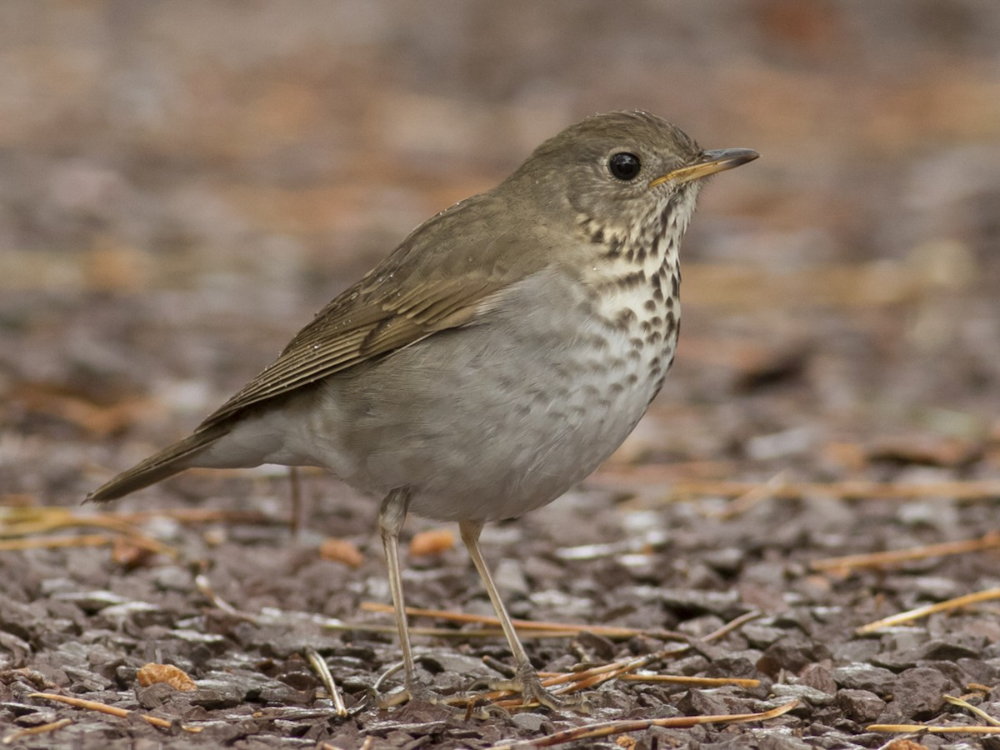]

.center[]
]


???

The idea for the project comes from the observation of Bicknell's trush restricted habitat response to climate change

CC might not only shift sp RL, but also modify the species distribution

---


```{r setup, include=FALSE}
options(htmltools.dir.version = FALSE)
```

# Lots of variability in species responses

.center[
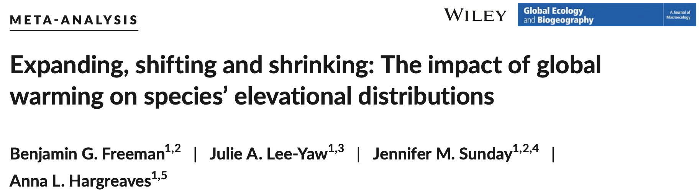

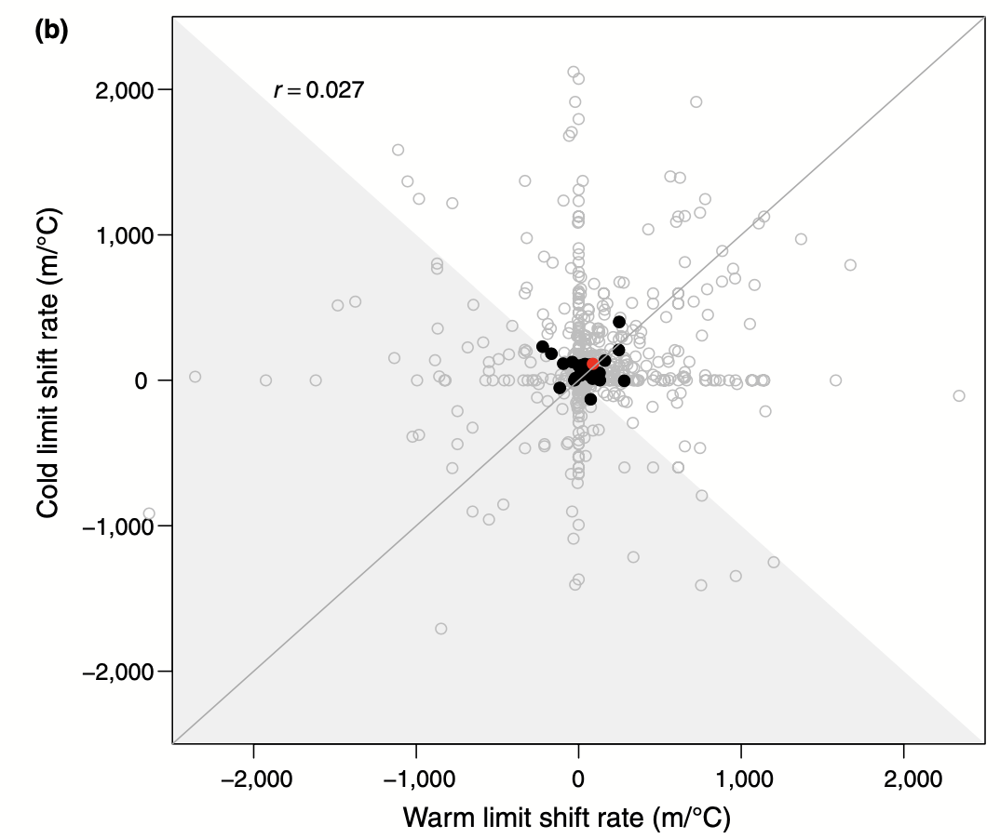

]

???

Réponse aux cc la plus souvent rapportée: déplacement des distributions vers les pôles et altitudes

Le déplacement des distributions est souvent raportée comme coincidant avec des changements abiotique de l'environnement aux limites de distribution
  - Cela a entrainé un fort intérêt pour la compréhension des méchanismes qui limitent la distribution des espèces 
  - Des études récentes ont souligné l'importance des interactions biotiques (wisz_role_2013)

## Grande variabilité dans la réponse des distribution: les facteurs abiotiques n'expliquent complètement les déplacements de distribution (freeman_expanding_2018)

Pour comprendre la réponse des espèces aux cc, compréhension des effets des interactions sur les RL et leur réponse aux cc.

---

# Bottom-up system

## Trees are lagging behind climate change

.center[
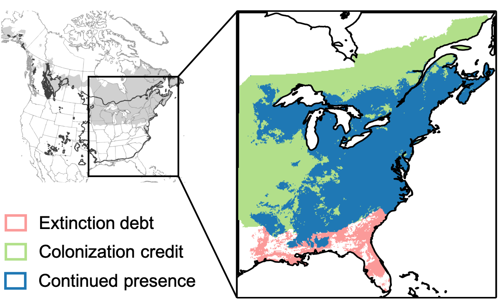
]

.cite[Talluto et al. [2017](https://www.nature.com/articles/s41559-017-0182) Nat. Ecol. Evol.]

???

User-habitat system = bottom-up system
---

# Bottom-up system

## Passerine birds are mobile, but limited by their habitat

.pull-left[
<br>
Metapopulation theory defines the equilibrium __range limits__ as an equilibrium of the _extinction_ and _colonization_ processes

<br>
$$h(T^{*}) > \frac{e(T^{*})}{c(T^{*})}$$
]

.pull-right[
<br>
.center[]
]

???

La réponse de certaines espèces pour les quelles les arbres constituent leur habitat pourrait être modifée

Ce qui est interessent, c'est que l'habitat et l'espèce répondent différemment aux cc. 

## Ce système permet d'évaluer l'effet des interactions sur la réponse des espèces aux cc.

---

class: inverse, center, middle

# What are the combined effects of climate change and habitat availability on distributions?

<html><div style='float:left'></div><hr color='#EB811B' size=1px width=720px></html> 

## 1- What is the impact of habitat responssiveness on species response? 

## 2- Is the response species specific?

???

# Pour comprendre la réponse des espèce aux cc

Il faut comprendre les effets combinés des cc et des interactions sur l'aire de distribution

J'évalue les changements d'aire de distribution en réponse au climat et à la disponibilité d'habitat par une étude de simulation utilisant un modèle de métapop

J'explore 4 scénarios pour des traits fonctionnels et des structures d'habitat différents.

---

# Probabilistic model

The model is a markovian process that defines a species' presence-absence dynamics on a landscape divided into patches

<br>
$$P(X_{t+1}|X_{t}, A, N, B)$$

--

<br><br>
.center[   ]

???

Building the model has involved so much more than sitting down and writing lines of code

* software carpentry
* Version control
* C++ coding
* Algorithm optimizing

---

#  Simulations

.pull-left[
The climatic gradient corresponds to Montréal - Chibougamau

The landscape in composed of 120,000 habitat patches

Habitat response to climate change is realistic

Each time steps represents 5 years

The system's response is simulated over 100 years of climate warming

Results shown are those for the RCP4.5 climate scenario
]

.pull-right[

```{r load gifski, echo=FALSE, message=FALSE}
if(!require('gifski')) install.packages('gifski')
library(gifski)
```

```{r habitat gif, echo=FALSE, message=FALSE, warning=FALSE, animation.hook="gifski"}
results <- readRDS('assets/data/results_RCP4.5_f0.rds')

Habitat <- results[['Habitat']]

# Extra parameters
height <- nrow(Habitat[[1]])
width <- ncol(Habitat[[1]])

  # Habitat matrices converted to numerical matrices
  for(i in 1:length(Habitat)){
    Habitat[[i]][Habitat[[i]]=="B"] <- 1
    Habitat[[i]][Habitat[[i]]=="M"] <- 2
    Habitat[[i]][Habitat[[i]]=="T"] <- 3
    Habitat[[i]][Habitat[[i]]=="R"] <- 4
    m <- mapply(Habitat[[i]], FUN=as.numeric)
    Habitat[[i]] <- matrix(data=m, ncol=width, nrow=height)
  }

  # Store values for each time step
  rasters <- list()
  for(layer in 1:length(Habitat)){

    # # Initiate raster
    assign('r', raster::raster(nrow=height,ncol=width, xmn=0, xmx=width, ymn=0, ymx=height))

    # # Set values to raster objects
    raster::values(r) <- Habitat[[layer]]
    rasters[layer] <- r
  }

  # Stack rasters
  stack = raster::stack(rasters)

  # Animate
  timeStep <- 100/(length(Habitat) - 2)
  raster::animate(stack, pause=0.03, n=1, axes=FALSE, box=FALSE,
                  main = round(c(0, seq(2020, 2120, by = timeStep))),
                  col = c("darkcyan", "palegreen3", "orange", "black"),
                  legend = FALSE)

```

]

---

# Distribution changes

.pull-left[
### Measures of distribution change

1- Range shift
  * Mismatch
  * Migration rate

  
2- Distribution modification
  * $\Delta$ occupancy
  * Total state change*
]

.pull-right[
```{r species gif, echo=FALSE, message=FALSE, warning=FALSE, animation.hook="gifski"}
results <- readRDS('assets/data/results_RCP4.5_f0.rds')

Presence <- results[['Presence']]

  height <- nrow(Presence[[1]])
  width <- ncol(Presence[[1]])

  # Store values for each time step
  rasters <- list()
  for(layer in 1:length(Presence)){

    # # Initiate raster
    assign('r', raster::raster(nrow=height, ncol=width, xmn=0, xmx=width, ymn=0, ymx=height))

    # # Set values to raster objects
    raster::values(r) <- Presence[[layer]]
    rasters[layer] <- r
  }

  # Stack raster objects
  stack = raster::stack(rasters)

  # Plot gif object
  timeStep <- 100/(length(Presence) - 2)
  raster::animate(stack, pause=0.03, n=1, axes=FALSE, box=FALSE,
                  main = round(c(0, seq(2020, 2120, by = timeStep))),
                  legend = FALSE)
```
]

---

class: inverse, center, middle

# What are the combined effects of climate change and habitat availability on distributions?

<html><div style='float:left'></div><hr color='#EB811B' size=1px width=720px></html> 

## 1- What is the impact of habitat responsiveness on species response? 

---
# Habitat responsiveness

## What is the impact of habitat responsiveness on species response? 

.pull-left[
.right[
<br>
Slow

<br><br>
Real

<br><br>
Fast
]
]

.pull-right[


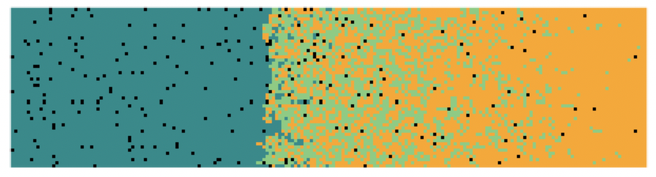

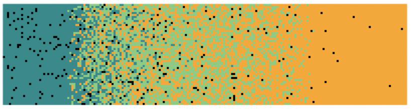
]

---

# Habitat responsiveness

## What is the impact of habitat responssiveness on species response?

.pull-left[
.center[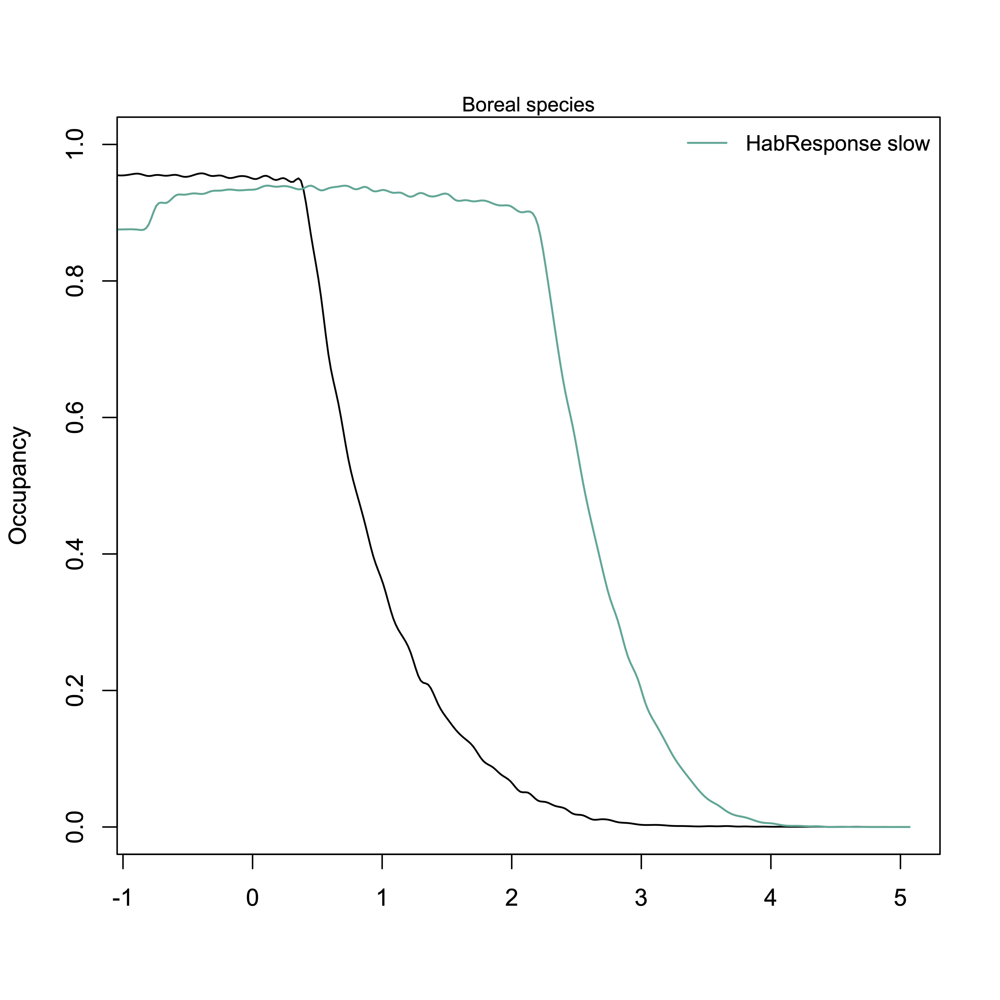]

.center[.tiny[Temperature (°C)]]
]

.pull-right[
### Slow habitat responsiveness

Large mismatch

No changes to the distribution
]

---

# Habitat responsiveness

## What is the impact of habitat responsiveness on species response?

.pull-left[
.center[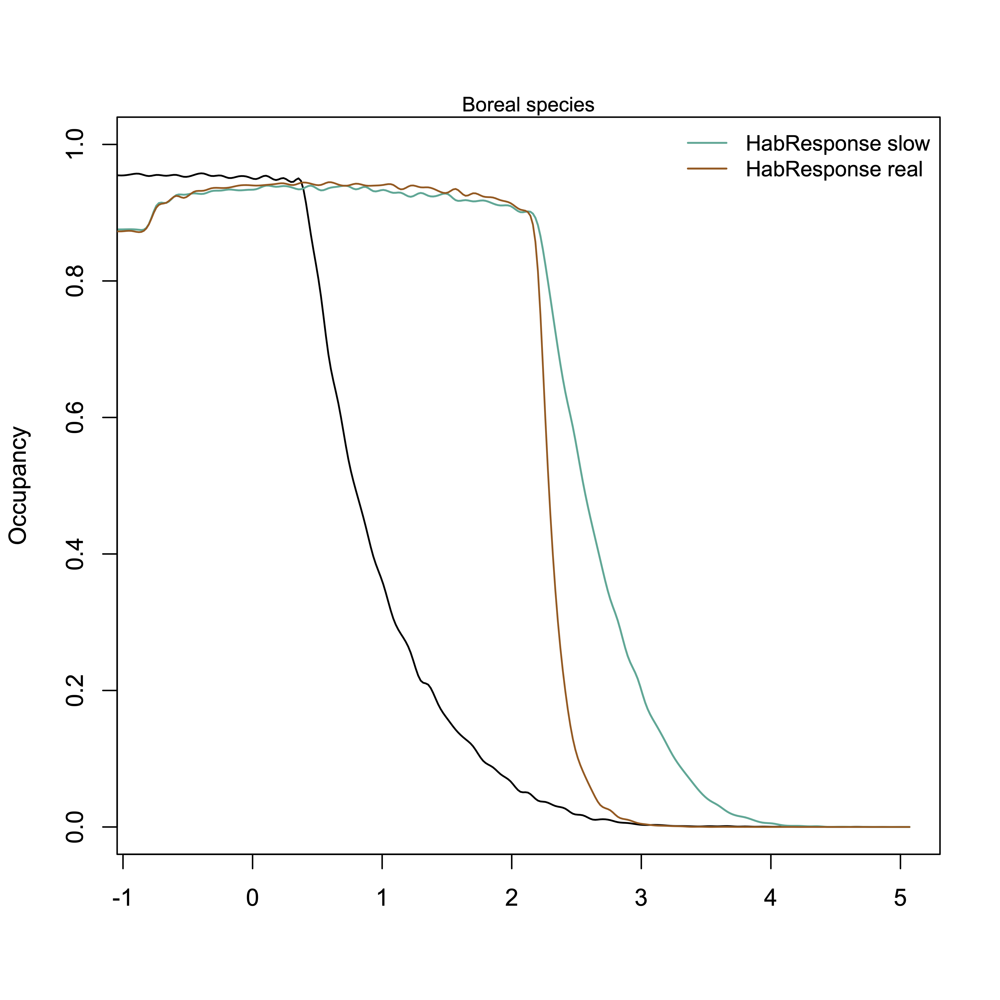]

.center[.tiny[Temperature (°C)]]
]

.pull-right[
### Slow habitat responsiveness

Large mismatch

No changes to the distribution

### Realistic habitat responsiveness

Little mismatch

Steep range limit
]

---

# Habitat responsiveness

## What is the impact of habitat responssiveness on species response?

.pull-left[
.center[]

.center[.tiny[Temperature (°C)]]
]

.pull-right[
### Slow habitat responsiveness

Large mismatch

No changes to the distribution

### Realistic habitat responsiveness

Little mismatch

Steep range limit

### Fast habitat responsiveness

Close to equilibrium distribution?
]

---

# Habitat responsiveness

## What is the impact of habitat responssiveness on species response?

.pull-left[
.center[]

.center[.tiny[Temperature (°C)]]
]

.pull-right[
<br>
Little impact on species distributions

Affects mismtach (extent of the range shift)

Affects mainly the steepness of the range limit
]

---
class: inverse, center, middle

# What are the combined effects of climate change and habitat availability on distributions?

<html><div style='float:left'></div><hr color='#EB811B' size=1px width=720px></html> 

## 2- Is the response species specific?

---

# Dispersal distance

## Is the response species specific?

.center[
```{r dispersalDist_fig, echo=FALSE, message=FALSE, fig.width = 10, fig.asp = .62}
alpha = c(2.1715, 21.715, 43.43)
alpha1 <- sapply(1:200, function(x) exp(-1 / alpha[1] * x))
alpha2 <- sapply(1:200, function(x) exp(-1 / alpha[2] * x))
alpha3 <- sapply(1:200, function(x) exp(-1 / alpha[3] * x))

plot(x = 1:200, y = alpha1, type = "l", col = "black", ylim = c(0,1), ylab = "Dispersal probability", xlab = "Distance (patch)", lwd = 3)
lines(x = 1:200, y = alpha2, type = "l", col = "blue", lwd = 3)
lines(x = 1:200, y = alpha3, type = "l", col = "red", lwd = 3)
legend('topright', legend = c('10 patches', '100 patches', '200 patches'), col = c('black', 'blue', 'red'), title = "Critical distance", lwd = 3)
```
]

---

# Dispersal distance

## Is the response species specific?

.pull-left[
.center[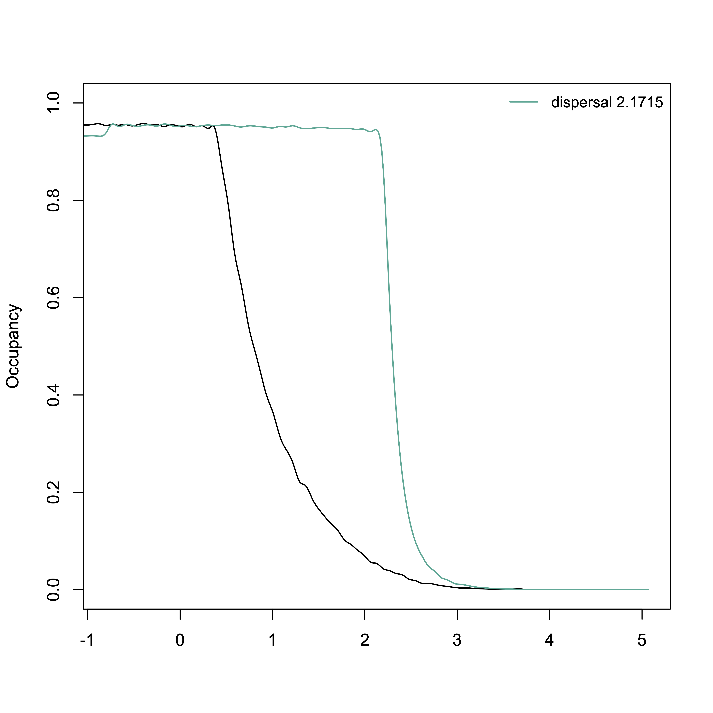]

.center[.tiny[Temperature (°C)]]
]

.pull-right[
### Limited dispersal

Little mismatch

Steep range limit
]

---

# Dispersal distance

## Is the response species specific?

.pull-left[
.center[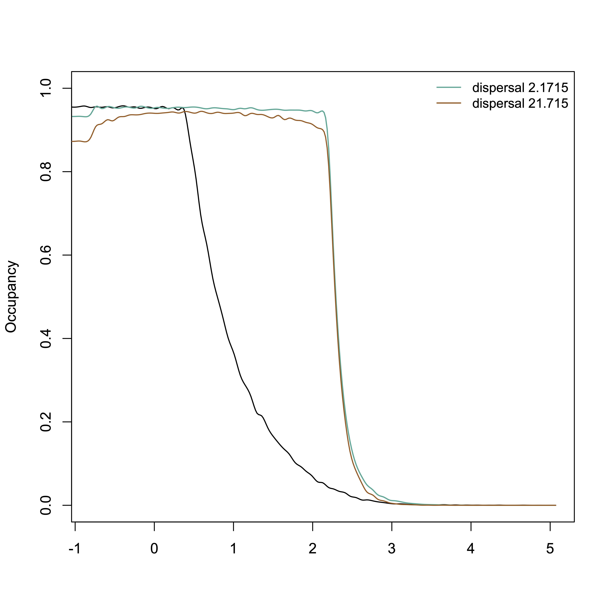]

.center[.tiny[Temperature (°C)]]
]

.pull-right[
### Limited dispersal

Little mismatch

Steep range limit

### Medium dispersal

Very similar effects
]

---

# Dispersal distance

## Is the response species specific?

.pull-left[
.center[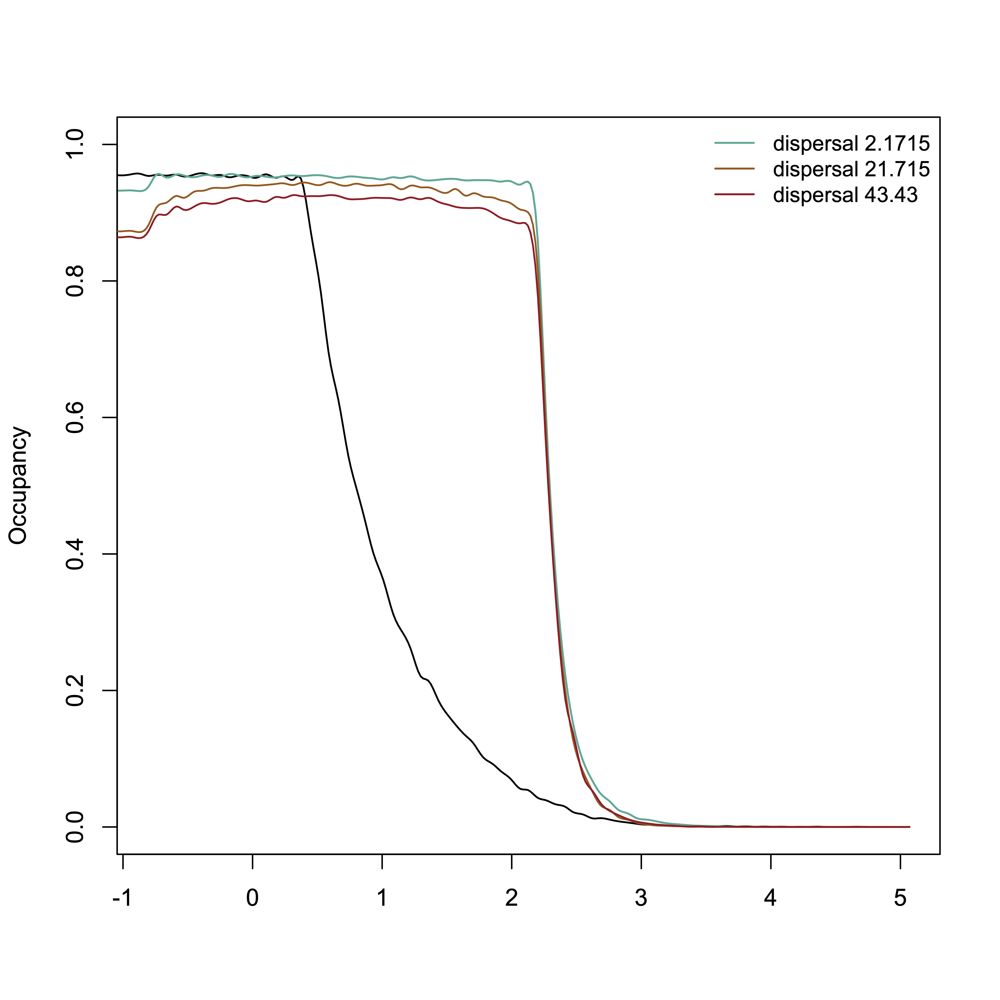]

.center[.tiny[Temperature (°C)]]
]

.pull-right[
### Limited dispersal

Little mismatch

Steep range limit

### Medium dispersal

Very similar effects

### High dispersal 

Very similar effects
]

---

# Landscape fragmentation

## Is the response species specific?

.pull-left[
.right[
<br>
Linear

<br><br>
Fragmented

<br><br>
Highly fragmented
]
]

.pull-right[
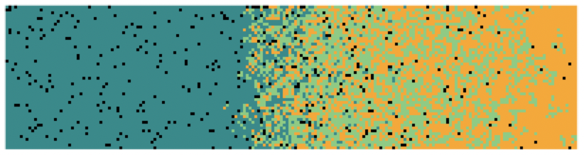


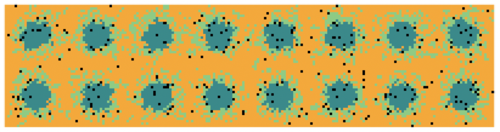
]

---

# Landscape fragmentation

## Is the response species specific?

.pull-left[
.center[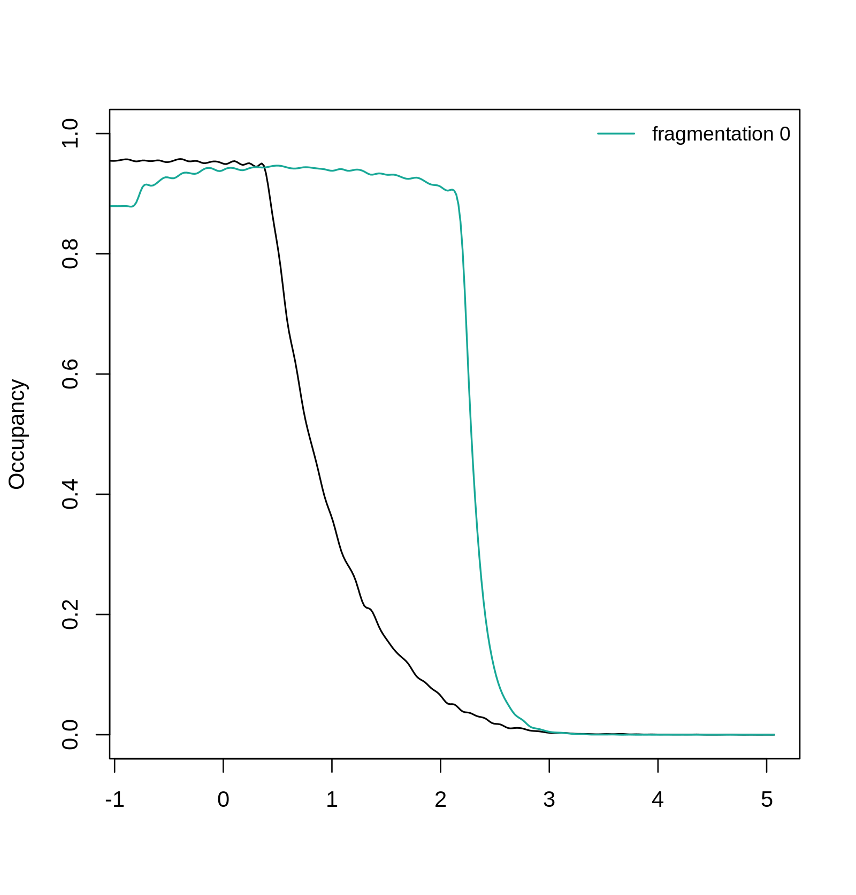]

.center[.tiny[Temperature (°C)]]
]

.pull-right[
### Linear

Little mismatch

Steep range limit
]

---

# Landscape fragmentation

## Is the response species specific?

.pull-left[
.center[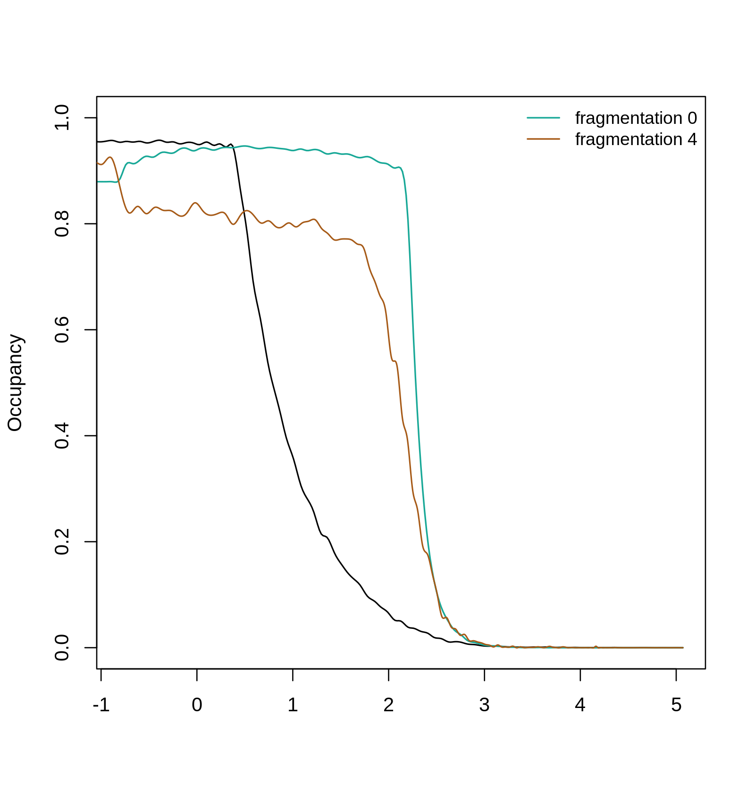]

.center[.tiny[Temperature (°C)]]
]

.pull-right[
### Linear

Little mismatch

Steep range limit

### Fragmented

Reduced occupancy
]

---

# Landscape fragmentation

## Is the response species specific?

.pull-left[
.center[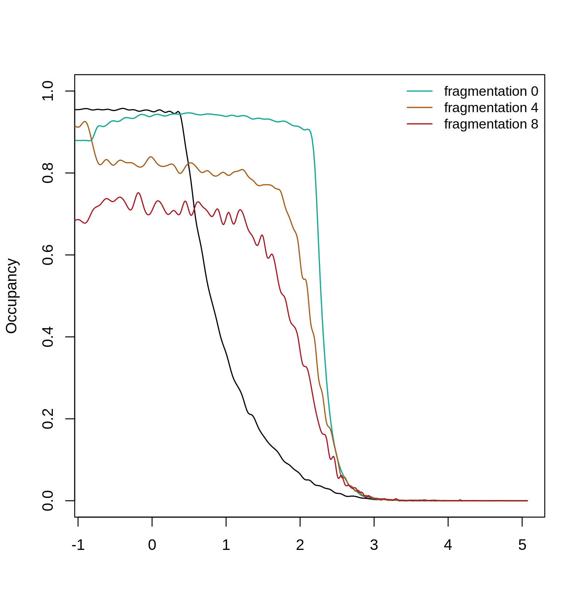]

.center[.tiny[Temperature (°C)]]
]

.pull-right[
### Linear

Little mismatch

Steep range limit

### Fragmented

Reduced occupancy

### Highly fragmented

Reduced occupancy
]

---

# Landscape fragmentation

## Is the response species specific?

In some ways, yes

What about species with expanding ranges (temperate species)?

???

Dispersal has little effect, but it might be that the distribution distances are wrong?

Fragmentation does not affect mismatch, but seems to modify species distributions

---

# What's coming up?

.pull-left[
## Issues

Climate prevalence distribution must be the same in all landscapes

Normalization of the dispersal PDFs: How to make scenarios comparable?

Measure of total distribution change: Number of state transitions?
]

--

.pull-right[
## Coming up

R package
* Continuous integration
* Reproducibility

Rounds of simulation on Béluga

Figures
]

---

# Projected timeline

.tiny[
|      | 2019 | 2020| 2021 |
| :--- | :--- |:--- | :--- |
| Winter  |  |  Literature review <br> Metapopulation toy models<br>Research proposal<br>BIOS2 data carpentry workshop<br>BIOS2 software carpentry workshop<br>**ECL750-Analyse avancée des données écologiques**<br>**BIO700-Séminaire de recherche 1**  | Model analysis <br> Thesis writing <br> Building R packages workshop <br> **PBI702-Séminaire de recherche 2**  |
| Summer  |   | Preliminary model construction <br> Research proposal <br> Scicom training <br> Learned C++ language <br> **SCI741-Data driven ecological synthesis**  | Thesis writing <br> Initial submission <br> 2nd internship <br> **BIO793-Mémoire** <br> **ECL707-Modélisation de la biodiversité** |
| Fall  | Literature review <br> QCBS symposium (poster) <br> 1st committee meeting  | Final model construction <br> Model validation & analysis <br> Learned to use super calculators <br> CIEE-BIOS2 synthesis working group <br> NCC internship <br> QCBS workshops <br> 2nd committee meeting  | Final submission  |

]


---

# Simulation results

.center[]

---

# Numerical results

.center[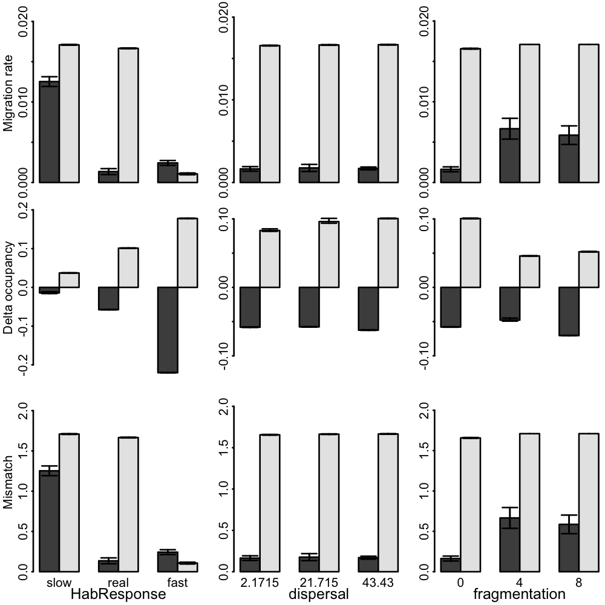]
