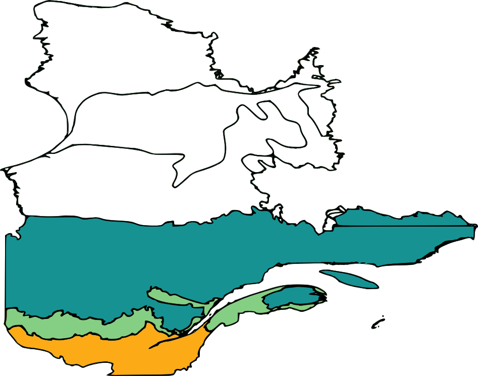
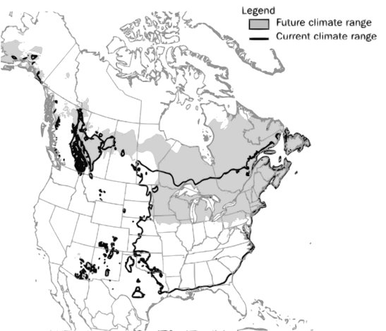
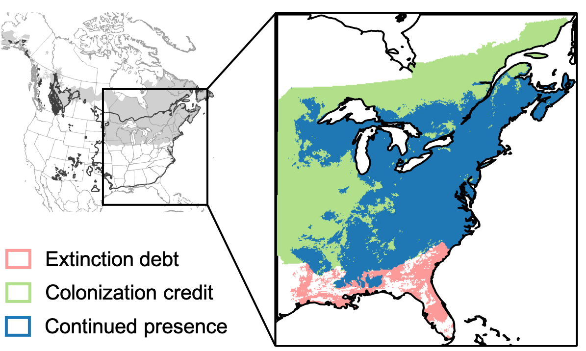
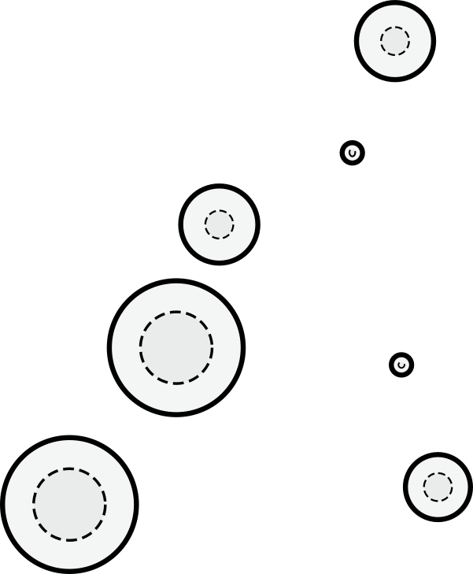
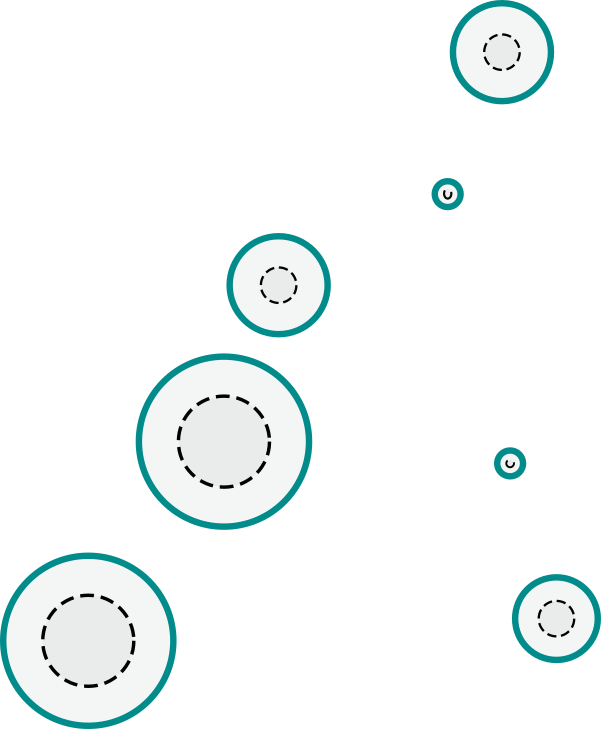
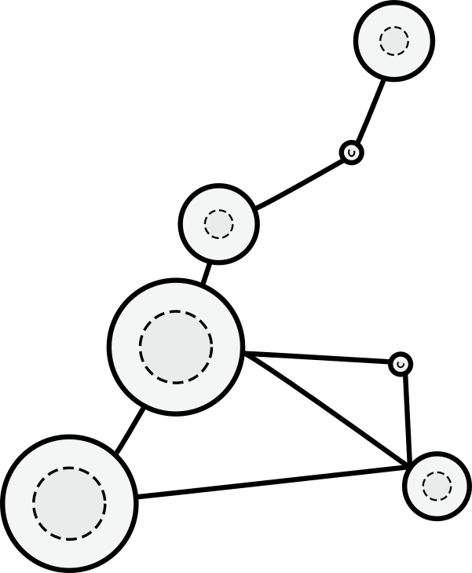

```{r setup, include=FALSE}
knitr::opts_chunk$set(
  comment = "#",
  cache = TRUE,
  collapse = TRUE,
  warning = FALSE,
  message = FALSE,
  fig.width = 7,
  fig.height = 5,
  fig.align = 'center',
  fig.retina = 3
)

options(htmltools.dir.version = FALSE)

# base plot layout
mypar = list(mar = c(3.5,4.5,1,1), mgp = c(1.5, 0.3, 0), bg="transparent", tck = -.008)

# Rscript -e "rmarkdown::render('index.Rmd')"
```

class: title-slide, middle

# Effets complexes du réchauffement climatique 

<hr width="65%" align="left" size="0.3" color="orange"></hr>

## Comment répondra la distribution des espèces?

<br>
### Victor Cameron

### Avril 2021

<br><br>
[<i class="fa fa-github fa-lg" style="color:#e7e8e2"></i> vcameron1](https://github.com/vcameron1/Talk_STM)

???

Sujet: complexité, réchauffement, distribution

Approche: théorique; définie théorie + modèle; pas d'hypothèses

théorie = résultat

---

# Écosystèmes et réchauffement climatique

## Les écosystèmes sont sensibles aux variations du climat

.center[ 
Domaines bioclimatiques du Québec


]

???

lien distribution - climat

Domaines bioclimatiques: gradient en latitude et en altitude

réchauffement climatique: déplacement + effets sur la biodiversité

La réponse des écosystèmes aux cc est complexe et multidimensionnel

***Je ne suis pas le premier à m'intéresser au problème***

---

# Écosystèmes et réchauffement climatique

## Correlation entre conditions climatiques et présence 


.pull-right[.center[]]

.cite[McKinney et al. [2007](https://academic.oup.com/bioscience/article/57/11/929/234249?login=true) BioScience.]

.pull-left[
Modèles de distribution d'espèces (SDMs)
- Distribution à l'équilibre avec l'enveloppe climatique<br>
- Réponse linéaire et instantanée aux changements climatiques
]

???

Premier pas vers une compréhension de l'effet des changements climatiques sur la distribution des espèces

SDM: Correlation climat-présence + projection

Exemple: érable à sucre

Suppositions: réalisme limité

---

# Écosystèmes et réchauffement climatique

## Taux d'expansion en fonction de traits spécifiques
Modèles mécanistiques

<br><br>
.font200[$$S = 2\sqrt{rD}$$]

.cite[Talluto et al. [2017](https://doi.org/10.1038/s41559-017-0182) Nat Ecol Evol, Svenning et al. [2014](https://doi.org/10.1111/j.1600-0587.2013.00574.x) Ecography.]

???

Pas supplémentaire vers la compréhension par Svenning et al.

Intégration de processus mécanistiques: relation climat - distribution 

*mécanistique* fait référence à l'utilisation explicite de paramètres qui décrivent des processus

S = rD

Interactions biotiques

---

# Écosystèmes et réchauffement climatique

## Taux d'expansion en fonction de traits spécifiques
Modèles mécanistiques

.center[]

.cite[Talluto et al. [2017](https://doi.org/10.1038/s41559-017-0182) Nat Ecol Evol, Svenning et al. [2014](https://doi.org/10.1111/j.1600-0587.2013.00574.x) Ecography.]

???

érable à sucre

SDM: suppose réponse immédiate 

Approche mécanistique: limite de dispersion + démographie faible

Exemple: décalage distribution - climat

Approche simpliste qui s'intéresse à la réponse d'une espèce et qui suppose un paysage homogène et continue

---

# Écosystèmes et réchauffement climatique

La réalité est plus ***complexe***: les écosystèmes sont composés de multiples espèces liées par leurs *interactions* et présent sur des *paysages fragmentés*

.center[]

???

Complexe: espèces + interactions + paysage

Pour illustrer la problématique, prenons la grive

interaction oiseau-habitat

Théorie générale: s'applique aux autres types d'interactions

---
class: inverse
background-image: url("assets/img/grive.jpg")

# La grive de Bicknell

.cite[Jim Tietz [2017](https://macaulaylibrary.org/asset/50164031) Macaulay Library.]

???

Espèce présente Estrie

Distribution: climat frais + élévation + habitat forêt boréale

spécialiste d'habitat: sa distribution est dépendante de celle de son habitat

---

# La grive de Bicknell .small[.grey[\- climat]]

.pull-left[
<br><br>

]

???

Montagnes vertes du Nord

Grive habite certains sommets

Représente paysage fragmenté 

--

<br><br><br>
.pull-right[.center[]]

???

Représentation abstraite paysage

Parcelles où les conditions sont favorables

---

# La grive de Bicknell .small[.grey[\- climat]]

.pull-left[
<br><br>

]

<br><br><br>
.pull-right[.center[]]

???

Réchauffement climatique = élévation des conditions climatiques favorables

= Contraction des parcelles

---

# La grive de Bicknell .small[.grey[\- habitat]]

.pull-left[
<br><br>

]

<br><br><br>
.pull-right[.center[]]

.cite[Vissault et al. [2020](https://doi.org/10.1111/jbi.13978) Journal of Biogeography.]

???

Contraction des parcelles, mais décalage forêt boréale

Forêt: faible démographie + dispersion limitée

---

# La grive de Bicknell .small[.grey[\- paysage]]

.pull-left[
<br><br>

]

<br><br><br>
.pull-right[.center[]]

???

À l'échelle du paysage: parcelles connectées par dispersion

Contraction + perte de sommets = ***connectivité***

---

# La grive de Bicknell .small[.grey[\- paysage]]

.pull-left[
<br><br>

]

<br><br><br><br>
.pull-right[.center[]]

???


Connectivité: habilité de la grive à disperser + coloniser sommets

Comment est-ce que la grive de Bicknel répondra au réchauffement du climat? Il faudra s'intéresser au **réchauffement du climat**, la **réponse des habitats forestiers boréaux** et aux **caractéristiques du paysage**

---

class: inverse, center, middle

# Objectifs

Réponse de la grive au réchauffement du climat

<html><div style='float:left'></div><hr color='#EB811B' size=1px width=720px></html><br>

## 1. Établir la théorie permettant de définir un modèle afin d'évaluer les changements de distribution en réponse au réchauffement climatique

## 2. Présenter comment le modèle permet d'évaluer les effets de:
.left[
- Réchauffement des températures<br>
- Décalage de la forêt boréale par rapport au réchauffement du climat<br>
- Structure spatiale du paysage
]

???

**Objectif**: établir la théorie qui permettra d'évaluer les changements de distribution de la grive en réponse au réchauffement climatique

Cette théorie prendra la forme d'un modèle.

***La théorie permet de modéliser un système complexe; la modélisation permet de faire des prédictions***

Résultats: Démonstration que la théorie/modèle est **pertinente** et parvient à **évaluer les changements de distribution**

3 exemples:
1. l'effet du réchauffement de la température
2. l'effet du décalage de l'habitat
3. l'effet de la disposition spatiale du paysage

Grive = caricature pour inspirer l'analyse; portée du travail plus large

---

# Théorie

## Métapopulation

.pull-left[
La distribution à l'échelle régionale peut être représentée par une métapopulation

Les parcelles peuvent être *colonisées* si elles sont inoccupées ou s'*éteindre* si elles sont occupées

Fraction des parcelles occupées $P$
]

.pull-right[
```{r load gifski, echo=FALSE, message=FALSE}
if(!require('gifski')) install.packages('gifski')
library(gifski)
```

```{r habitat gif, echo=FALSE, message=FALSE, warning=FALSE, animation.hook="gifski", fig.height = 6.5}
results <- readRDS('assets/data/results_RCP4.5_f0.rds')

Habitat <- results[['Habitat']]

# Extra parameters
height <- nrow(Habitat[[1]])
width <- ncol(Habitat[[1]])

  # Habitat matrices converted to numerical matrices
  for(i in 1:length(Habitat)){
    Habitat[[i]][Habitat[[i]]=="B"] <- 1
    Habitat[[i]][Habitat[[i]]=="M"] <- 2
    Habitat[[i]][Habitat[[i]]=="T"] <- 3
    Habitat[[i]][Habitat[[i]]=="R"] <- 4
    m <- mapply(Habitat[[i]], FUN=as.numeric)
    Habitat[[i]] <- matrix(data=m, ncol=width, nrow=height)
  }

  # Store values for each time step
  rasters <- list()
  for(layer in 1:length(Habitat)){

    # # Initiate raster
    assign('r', raster::raster(nrow=height,ncol=width, xmn=0, xmx=width, ymn=0, ymx=height))

    # # Set values to raster objects
    raster::values(r) <- Habitat[[layer]]
    rasters[layer] <- r
  }

  # Stack rasters
  stack = raster::stack(rasters)

  # Animate
  timeStep <- 100/(length(Habitat) - 2)
  raster::animate(stack, pause=0.03, n=1, axes=FALSE, box=FALSE,
                  main = round(c(0, seq(2020, 2120, by = timeStep))),
                  col = c("darkcyan", "palegreen3", "orange", "black"),
                  legend = FALSE, bg="transparent")

```
]

???

Concept de métapopulation = distribution régionale

métapopulation: ensemble de parcelles (le paysage) qui peuvent être **occupées** ou **pas** par la grive

Quantitée d'intérêt: $P$ (dynamique de la distribution de la grive)

---

# Modèle

## Métapopulation

.pull-left[
Fraction des parcelles occupées $P$ en fonction du taux de colonisation $c$ et d'extinction $e$

$$\frac{dP}{dt} = \underbrace{cP(1-P)}_{\text{Taux de colonisation}} - \underbrace{eP}_{\text{Taux d'extinction}}$$
]

.pull-right[
```{r habitat gif2, echo=FALSE, message=FALSE, warning=FALSE, animation.hook="gifski", fig.height = 6.5}
results <- readRDS('assets/data/results_RCP4.5_f0.rds')

Habitat <- results[['Habitat']]

# Extra parameters
height <- nrow(Habitat[[1]])
width <- ncol(Habitat[[1]])

  # Habitat matrices converted to numerical matrices
  for(i in 1:length(Habitat)){
    Habitat[[i]][Habitat[[i]]=="B"] <- 1
    Habitat[[i]][Habitat[[i]]=="M"] <- 2
    Habitat[[i]][Habitat[[i]]=="T"] <- 3
    Habitat[[i]][Habitat[[i]]=="R"] <- 4
    m <- mapply(Habitat[[i]], FUN=as.numeric)
    Habitat[[i]] <- matrix(data=m, ncol=width, nrow=height)
  }

  # Store values for each time step
  rasters <- list()
  for(layer in 1:length(Habitat)){

    # # Initiate raster
    assign('r', raster::raster(nrow=height,ncol=width, xmn=0, xmx=width, ymn=0, ymx=height))

    # # Set values to raster objects
    raster::values(r) <- Habitat[[layer]]
    rasters[layer] <- r
  }

  # Stack rasters
  stack = raster::stack(rasters)

  # Animate
  timeStep <- 100/(length(Habitat) - 2)
  raster::animate(stack, pause=0.03, n=1, axes=FALSE, box=FALSE,
                  main = round(c(0, seq(2020, 2120, by = timeStep))),
                  col = c("darkcyan", "palegreen3", "orange", "black"),
                  legend = FALSE, bg="transparent")

```
]

???

présence/absence = colonisation + extinction

Dynamiques de métapop = taux de changement dans le temps

dynamiques de la métapop est influencée par les processus de colonisation et d'extinction

e et c = variables abiotiques

---

# Modèle

## Métapopulation

.pull-left[
Fraction des parcelles occupées $P$ en fonction du taux de colonisation $c$ et d'extinction $e$

$$\frac{dP}{dt} = cP(\underbrace{h}_{\text{Disponibilité d'habitat}}-P) - eP$$
]

.pull-right[
```{r habitat gif3, echo=FALSE, message=FALSE, warning=FALSE, animation.hook="gifski", fig.height = 6.5}
results <- readRDS('assets/data/results_RCP4.5_f0.rds')

Habitat <- results[['Habitat']]

# Extra parameters
height <- nrow(Habitat[[1]])
width <- ncol(Habitat[[1]])

  # Habitat matrices converted to numerical matrices
  for(i in 1:length(Habitat)){
    Habitat[[i]][Habitat[[i]]=="B"] <- 1
    Habitat[[i]][Habitat[[i]]=="M"] <- 2
    Habitat[[i]][Habitat[[i]]=="T"] <- 3
    Habitat[[i]][Habitat[[i]]=="R"] <- 4
    m <- mapply(Habitat[[i]], FUN=as.numeric)
    Habitat[[i]] <- matrix(data=m, ncol=width, nrow=height)
  }

  # Store values for each time step
  rasters <- list()
  for(layer in 1:length(Habitat)){

    # # Initiate raster
    assign('r', raster::raster(nrow=height,ncol=width, xmn=0, xmx=width, ymn=0, ymx=height))

    # # Set values to raster objects
    raster::values(r) <- Habitat[[layer]]
    rasters[layer] <- r
  }

  # Stack rasters
  stack = raster::stack(rasters)

  # Animate
  timeStep <- 100/(length(Habitat) - 2)
  raster::animate(stack, pause=0.03, n=1, axes=FALSE, box=FALSE,
                  main = round(c(0, seq(2020, 2120, by = timeStep))),
                  col = c("darkcyan", "palegreen3", "orange", "black"),
                  legend = FALSE, bg="transparent")

```
]

???
effet de l'habitat sur la grive: disponibilité d'habitat (h)

h: parcelles qui peuvent être colonisées

Généralisable:
- à toutes espèces (e/c)
- à toutes interactions (h= expression de la distribution)

---

# Modèle

## Métapopulation

.cite[Levins [1969](https://doi.org/10.1093/besa/15.3.237) Am Entomol.]

$$\frac{dP}{dt} = cP(h-P) - eP$$

La fraction des parcelles de forêt boréale occupées à l'équilibre $P^{*}_{h}$

$$P^{*}_{h} = 1 - \frac{e/c}{h}$$

???

intérêt = conditions à l'équilibre

Équilibre: conditions lorsque la fraction des parcelles occupées ne change plus ($dP/dt = 0$)

--

Et la condition pour laquelle la grive persiste

$$h > \frac{e}{c}$$

???

Persistance = $P^{*}_{h} > 0$

Persistance = fraction des parcelles en forêt boréale + caractéristiques propre à la grive

---

# Modèle

## Métapopulation .small[*spatialement explicite*]

.cite[Hanski [2001](https://doi.org/10.1007/s001140100246) Naturwissenschaften.]

***Probabilité*** que la parcelle $i$ soit occupée
$$\frac{dP_{i}}{dt} = cP_{i}(1-P_{i}) - eP_{i}$$

La Probabilité moyenne des parcelles de forêt boréale d'être occupées $P^{*}_{h}$

$$P_{\lambda}^{*} = 1 - \frac{e/c}{\lambda_{M}}$$

???

Spatialement explicite: un modèle/parcelle = **probabilité**

$\lambda_{M}$ = capacité de la métapopulation = connectivité

(capture l'impacte de la structure du paysage sur la persistance de la grive.)

$\lambda_{M}$ = h

Persistance = structure du paysage + caractéristiques propres à la grive

--

Et la condition pour laquelle la grive persiste

$$\lambda_{M} > \frac{e}{c}$$

---

# Modèle .small[.grey[\- climat]]

## Réchauffement du climat

Décroissance de la fraction de parcelles de forêt boréale occupées $P^{*}$ précipité 

.pull-left[
<br><br>
$$P^{*} = 1 - \frac{e/c}{h}$$

<br><br><br><br>
<span style="color: #EB811B;">
Les caractéristiques de l'espèce modulent le changement de distribution en réponse au réchauffement du climat
</span>
]

.pull-right[
```{r p*, echo=FALSE, message=FALSE, warning=FALSE}
par(mypar)

# Base plot
curve(1-((x)/(1-x)), 0,1,100, ylim=c(0,1), 
    lwd=2, yaxs="i", xaxs="i",
    yaxt='n', xaxt='n',
    cex.lab=2, cex.axis=1.5,
    ylab=expression(P^'*'), xlab='Temps')
curve(1-x, 0,1,100,add=T, lty=2, lwd=2)
text(0.3, 0.9, 'h=1', cex=1.5)
legend('topright', legend=c('Températures favorables', 'Grive de Bicknell'), lty=c(2,1), bty='n')
```
]

???

Effet réchauffement sur changements de distribution de la grive (**P**)

$e/c$ augmente; s'éloigne de l'optimum

- Prévalence températures favorables diminue linéairement
- P décroit exponentiellement

Augmentation des températures = perte prévalence de la grive précipitée

---

# Modèle .small[.grey[\- décalage]]

## Décalage dans la réponse de l'habitat

Le décalage de la forêt boréale entraine un déplacement de la limite de distribution inférieur à celui du climat, mais supérieur à celui de l'habitat

.pull-left[
<br>
$$P^{*} = 1 - \frac{e/c}{h}$$

<br>
$$h > \frac{e}{c}$$
]

.pull-right[
```{r EC0, echo=FALSE, message=FALSE, warning=FALSE}
par(mypar)
curve((0.8*x), 0,0.9,100, ylim=c(0,1), xlim=c(0,1),
    lwd=2, yaxt="n", xaxt="n",
    bty="l", yaxs="i", xaxs="i",
    cex.lab=2, cex.axis=1.5,
    ylab='', xlab='',
    col='darkorange')
axis(1, at=c(0.08,0.95), lab=c("Sommet", "Base"), tick=FALSE, cex.axis=1.5)

curve(0.8-x, 0,0.9,100,add=T, lwd=2, col='darkgreen')
text(0.02, 0.85, 'h', col='darkgreen', cex=1.5)
text(0.88, 0.8, 'e/c', col='darkorange', cex=1.5)
```
]

???

Effet du décalage de la forêt sur changements de distribution (**P** + **RL**)

plus complexe: température + habitat: approche visuelle

Sur montagne:
- Prévalence boréal diminue
- e/c augmente

---

# Modèle .small[.grey[\- décalage]]

## Décalage dans la réponse de l'habitat

Le décalage de la forêt boréale entraine un déplacement de la limite de distribution inférieur à celui du climat, mais supérieur à celui de l'habitat

.pull-left[
<br>
$$P^{*} = 1 - \frac{e/c}{h}$$

<br>
$$h > \frac{e}{c}$$
]

.pull-right[
```{r EC, echo=FALSE, message=FALSE, warning=FALSE}
par(mypar)
curve((0.8*x), 0,0.9,100, ylim=c(0,1), xlim=c(0,1),
    lwd=2, yaxt="n", xaxt="n",
    bty="l", yaxs="i", xaxs="i",
    cex.lab=2, cex.axis=1.5,
    ylab='', xlab='',
    col='darkorange')
axis(1, at=c(0.08,0.95), lab=c("Sommet", "Base"), tick=FALSE, cex.axis=1.5)

curve(0.8-x, 0,0.9,100,add=T, lwd=2, col='darkgreen')
text(0.02, 0.85, 'h', col='darkgreen', cex=1.5)
text(0.88, 0.8, 'e/c', col='darkorange', cex=1.5)


# Distribution
mycol1 <- rgb(77, 77, 77, max = 255, alpha = 90)
polygon(x=c(0,0.445,0.445,0), y=c(0,0, 0.355,0.355), col=mycol1, border=F)
```
]

???

Conditions persistance à l'équilibre = distribution

Limite de distribution

---

# Modèle .small[.grey[\- décalage]]

## Décalage dans la réponse de l'habitat

Le décalage de la forêt boréale entraine un déplacement de la limite de distribution inférieur à celui du climat, mais supérieur à celui de l'habitat

.pull-left[
<br>
$$P^{*} = 1 - \frac{e/c}{h}$$

<br>
$$h > \frac{e}{c}$$
]

.pull-right[
```{r EC2, echo=FALSE, message=FALSE, warning=FALSE}
par(mypar)
curve((0.8*x), 0,0.9,100, ylim=c(0,1), xlim=c(0,1),
    lwd=2, yaxt="n", xaxt="n",
    bty="l", yaxs="i", xaxs="i",
    cex.lab=2, cex.axis=1.5,
    ylab='', xlab='',
    col='darkorange')
axis(1, at=c(0.08,0.95), lab=c("Sommet", "Base"), tick=FALSE, cex.axis=1.5)

curve(0.8-x, 0,0.9,100,add=T, lwd=2, col='darkgreen')
text(0.02, 0.85, 'h', col='darkgreen', cex=1.5)
text(0.88, 0.8, 'e/c', col='darkorange', cex=1.5)


# Distribution
mycol1 <- rgb(77, 77, 77, max = 255, alpha = 90)
polygon(x=c(0,0.445,0.445,0), y=c(0,0, 0.355,0.355), col=mycol1, border=F)

# déplacement de e/c 
curve(0.8*x+0.2, 0,0.9,100,add=T, lwd=2, col='darkorange', lty=2)

# Déplacement des conditions climatiques
arrows(0.445,0.355,0.2,0.355, lwd=4)
```
]

???

Réchauffement = déplacement conditions favorables

- déplacement e/c vers sommet
- décalage de la forêt boréale

---

# Modèle .small[.grey[\- décalage]]

## Décalage dans la réponse de l'habitat

Le décalage de la forêt boréale entraine un déplacement de la limite de distribution inférieur à celui du climat, mais supérieur à celui de l'habitat

.pull-left[
<br>
$$P^{*} = 1 - \frac{e/c}{h}$$

<br>
$$h > \frac{e}{c}$$

<br>
<span style="color: #EB811B;">
La synchronicité des réponses est fondamentale aux changements de distribution
</span>
]

.pull-right[
```{r EC3, echo=FALSE, message=FALSE, warning=FALSE}
par(mypar)
curve((0.8*x), 0,0.9,100, ylim=c(0,1), xlim=c(0,1),
    lwd=2, yaxt="n", xaxt="n",
    bty="l", yaxs="i", xaxs="i",
    cex.lab=2, cex.axis=1.5,
    ylab='', xlab='',
    col='darkorange')
axis(1, at=c(0.08,0.95), lab=c("Sommet", "Base"), tick=FALSE, cex.axis=1.5)

curve(0.8-x, 0,0.9,100,add=T, lwd=2, col='darkgreen')
text(0.02, 0.85, 'h', col='darkgreen', cex=1.5)
text(0.88, 0.8, 'e/c', col='darkorange', cex=1.5)


# Distribution
mycol1 <- rgb(77, 77, 77, max = 255, alpha = 90)
polygon(x=c(0,0.445,0.445,0), y=c(0,0, 0.355,0.355), col=mycol1, border=F)

# Déplacement de e/c 
curve(0.8*x+0.2, 0,0.9,100,add=T, lwd=2, col='darkorange', lty=2)

# Nouvelle distribution
polygon(x=c(0,0.33,0.33,0), y=c(0,0, 0.47,0.47), col=mycol1, border=F)

# Déplacement des conditions climatiques
arrows(0.445,0.355,0.2,0.355, lwd=4)

# Déplacement de la limite de distribution
arrows(0.445,0.05,0.335,0.05, lwd=4)
```
]

???

déplacement limite de distribution

déplacement moindre que température = retard

plus qu'habitat = décalage grive-Forêt

changement de distribution:
- moindre que température
- plus que son habitat

---

# Modèle .small[.grey[\- fragmentation]]

## Perte de connectivité du paysage

La probabilité moyenne des parcelles de forêt boréale d'être occupées $P_{\lambda}^{*}$ par la grive dépend de ses caractéristiques propres $\frac{e}{c}$ et de la structure spatiale (connectivité) du paysage $\lambda_{M}$

.pull-left[
<br>
$$P_{\lambda}^{*} = 1 - \frac{e/c}{\lambda_{M}}$$

<br><br><br>
<span style="color: #EB811B;">
La structure du paysage est déterminente pour l'amplitude des impacts de la perte d'habitat sur les changements de distribution
</span>
]

.pull-right[
```{r P_lambda, echo=FALSE, message=FALSE, warning=FALSE}
par(mypar)

x <- seq(0,1, le=100)
delta <- 0.3
y <- 1-delta/x

plot(x=1-x, y=y, 
    ylim=c(0,1),
    type='l', lwd=2, yaxs="i", xaxs="i",
    xaxt='n', yaxt='n',
    cex.lab=2, cex.axis=1.5,
    ylab=expression(P[lambda]^'*'), xlab='Temps')
curve(1-(0.05+x), 0,1,100,add=T, lty=2, lwd=2)
text(0.1, 0.55, 'e/c=0.3', cex=1.5)
legend('topright', legend=c('Connectivité', 'Grive de Bicknell'), lty=c(2,1), bty='n')
```
]

???

Effet structure spatiale du paysage sur changement de distribution ( $P_{\lambda}^{*}$ )

perte de connectivité sur **P**
- $\lambda_{M}$ capacité de métapop

perte de connectivité = perte prob. présence de la grive précipitée

---

class: inverse, center, middle

# Conclusion et contributions

La théorie permet de modéliser un système complexe; la modélisation permet de faire des prédictions

<html><div style='float:left'></div><hr color='#EB811B' size=1px width=720px></html>

.left[
<i class="fa fa-check fa-lg" style="color:green"></i>
Ce modèle permet d'évaluer les changements de distribution en réponse au réchauffement du climat.

<i class="fa fa-check fa-lg" style="color:green"></i>
Ce modèle est un avancement par son approche *mécanistique*, qui intègre l'effet des *interactions* et du *paysage*.

<i class="fa fa-check fa-lg" style="color:green"></i>
Présence et la direction des effets du réchauffement climatique, du décalage de l'habitat et de la structure spatiale du paysage.

<span style="color: #EB811B;">
La généralité du modèle indique que la forme des relations peut changer d'une espèce à l'autre, mais que les relations se maintiennent.
</span>
]

???

Cette théorie/modèle répond à l'objectif fixé
- montre effet réchauf. clim. sur changements de distribution
- plus réalisme = avancement dans compréhension
- Modèle pertinent: présence + direction des effets des cc.

généralité: Alors que la forme des relations peut changer entre espèces, elles se maintiennent

---

class: inverse

# .center[Remerciements]
<html><div style='float:left'></div><hr color='#EB811B' size=1px width=720px></html>

.pull-left[.center[
## Superviseur
Dominique Gravel

<br>
## Comité d’encadrement

Marc Bélisle

Anna Hargreaves

Mark Vellend

<br>
## Membres du laboratoire Gravel
]]

.pull-right[


]

---

# Capacité de la métapopulation

Capacité de métapopulation: première valeur propre de la matrice de 'paysage'

$$Taux\;d'extinction_{i} = \frac{e}{A_{i}}$$

$$Taux\;de\;colonisation_{i} = c\sum{exp(-\alpha d_{ij})} A_{j}P_{j}$$

Notation matricielle pour décrire le système d'équations donnant le taux de changements de $p_{i}$: Matrice $M$ est composé des éléments $m_{ij} = exp(-\alpha d_{ij} A_{i}A_{j})$ pour $j \ne i$ et $m_{ii}=0$

Il existe une solution à l'équilibre pour $p^{*}_{i} > 0$ pour tous $i$ si $\lambda_{M} > \frac{e}{c}$

???

Ces suppositions (sur e et c) permettent de relier les processus les plus importants des métapop (e et c) à la structure spatiale du paysage (position et A)

---

# Modèle .small[.grey[\- exemple 2]]

## Décalage dans la réponse de l'habitat

Le décalage de la forêt boréale entraine un déplacement de la limite de distribution inférieur à celui du climat, mais supérieur à celui de l'habitat

.pull-left[
<br>
$$P^{*} = 1 - \frac{e/c}{h}$$

<br>
$$h > \frac{e}{c}$$
]

.pull-right[
```{r EC extra, echo=FALSE, message=FALSE, warning=FALSE}
par(mypar)
curve((0.8*x), 0,0.9,100, ylim=c(0,1), xlim=c(0,1),
    lwd=2, yaxt="n", xaxt="n",
    bty="l", yaxs="i", xaxs="i",
    cex.lab=2, cex.axis=1.5,
    ylab='', xlab='',
    col='darkorange')
axis(1, at=c(0.08,0.95), lab=c("Sommet", "Base"), tick=FALSE, cex.axis=1.5)

curve(0.8-x, 0,0.9,100,add=T, lwd=2, col='darkgreen')
text(0.02, 0.85, 'h', col='darkgreen', cex=1.5)
text(0.88, 0.8, 'e/c', col='darkorange', cex=1.5)


# Distribution
mycol1 <- rgb(77, 77, 77, max = 255, alpha = 90)
polygon(x=c(0,0.445,0.445,0), y=c(0,0, 0.355,0.355), col=mycol1, border=F)

# Déplacement de e/c 
curve(0.8*x+0.2, 0,0.9,100,add=T, lwd=2, col='darkorange', lty=2)

# Nouvelle distribution
polygon(x=c(0,0.33,0.33,0), y=c(0,0, 0.47,0.47), col=mycol1, border=F)
```
]

???

Un retard dans la réponse de l'habitat entraine:
- un retard de la réponse de la limite de distribution de la grive
- La réponse de la grive sera moindre que ce qui peut être attendu si l'on regarde uniquement le réchauffement climatique, mais supérieur à la modification de l'habitat

dispersion spatiale implicite

Un retard dans la réponse de l'habitat entraine:
1. un retard de la réponse de la limite de distribution de la grive
2. une augmentation de la valeur du ratio e/c à la limite de distribution
3. une augmentation de la disponibilité d'habitat à la limite de distribution
4. indirectement, une diminution du ratio e/c de l'habitat à la limit de distribution à la RL de la grive
5. également, une augmentation du ratio e/c à la limite de distribution de l'habitat

C-a-d:
1. La réponse de la grive sera moindre que ce qui peut être attendu si l'on regarde uniquement le réchauffement climatique, mais supérieur à la modification de l'habitat
2. Un ratio e/c plus important indique que le taux d'extinction gagne en importance sur le taux de colonisation et à la limite de distribution associée avec une contraction indique une vitesse de réponse plus importante: réponse non linéaire?!?
3. La disponibilité de l'habitat s'accroit au RL: 
4. Diminution du ratio e/c de h à RL de la grive indique que la RL de la grive se trouve où l'habitat répond plus lentement au cc
5. augmentation du ratio e/c à RL de l'habitat indique que l'habitat devient plus réactif

---