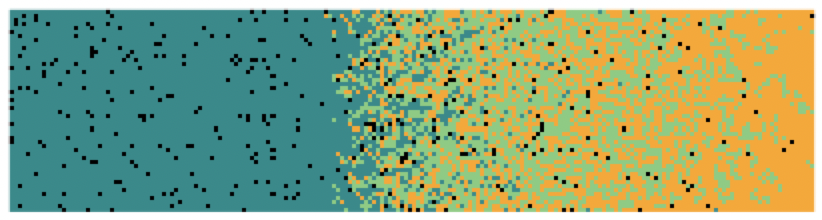

```{r setup, include=FALSE}
knitr::opts_chunk$set(
  comment = "#",
  cache = TRUE,
  collapse = TRUE,
  warning = FALSE,
  message = FALSE,
  fig.width = 7,
  fig.height = 5.25,
  fig.align = 'center',
  fig.retina = 3
)

options(htmltools.dir.version = FALSE)

# base plot layout
mypar = list(mar = c(3,3,0.5,0.5), mgp = c(1.5, 0.3, 0), tck = -.008)

# Rscript -e "rmarkdown::render('index.Rmd')"
```

class: title-slide, middle

# Aire de distribution et changements climatiques

<hr width="65%" align="left" size="0.3" color="orange"></hr>

## Comment les interactions biotiques modulent-elles la réponse?

<br>
### Victor Cameron

### Avril 2021

<br>
[<i class="fa fa-github fa-lg" style="color:#e7e8e2"></i> vcameron1](https://github.com/vcameron1/Talk_STM)

---

# Écosytèmes et réchauffement climatique

La réponse des écosystèmes est complexe

.center[ 
    <br>

]

???

Comprendre réponse des écosystèmes aux cc est complex, différentes réponses: études empiriques, simulations et meta analyses ont montré un décalage dans la distribution ou la réponse

---

# Écosytèmes et réchauffement climatique

Les **interactions biotiques** ont le potentiel d'influencer la vitesse de réponse

.center[]

.cite[Stralberg et al. [2015](https://onlinelibrary.wiley.com/doi/full/10.1111/ddi.12356) Diversity and Distributions, Svenning et al. [2014](https://onlinelibrary.wiley.com/doi/full/10.1111/j.1600-0587.2013.00574.x) Ecography.]

???

On s'attend à ce que les interactions biotiques influencent la réponse aux changements environnementaux: 
    s=rD: range shift mainly determined by demographie and dispersal, both affected by interactions
    Asynchronie entre les espèces: effets potentiels des colonization credits et extinction debts.

---

# Écosytèmes et réchauffement climatique

Tout comme les **caractéristiques du paysage**

.pull-left[
    <br><br>
    
]

--

.pull-right[]

---

# Écosytèmes et réchauffement climatique

Tout comme les **caractéristiques du paysage**

.pull-left[
    <br><br>
    
]

.pull-right[]

---

# Écosytèmes et réchauffement climatique

Tout comme les **caractéristiques du paysage**

.pull-left[
    <br><br>
    
]

.pull-right[]

---

# Écosytèmes et réchauffement climatique

Tout comme les **caractéristiques du paysage**

.pull-left[
    <br><br>
    
]

.pull-right[]

???

À L'échelle régionale, les changements environnementaux peuvent interagir avec les caractéristiques du paysage pour affecter la réponse.

Via la taille des patchs et la connectivité

---

# Écosytèmes et réchauffement climatique

## Système bottom-up: la grive de Bicknell et la forêt boréale

.cite[Vissault et al. [2017](https://doi.org/10.1111/jbi.13978) Journal of Biogeography.]

.pull-left[.center[]]

.pull-right[]


???

On s'attend à ce que les distributions shift à des latitudes ou altitudes plus élevées, mais nous savons peu sur l'effet des interactions, notamment pour les espèces spécialistes. Mon objectif est d'étudier l'effet de la réponse de la ressource sur la réponse d'un consommateur.

---

class: inverse, center, middle

# Le problème est complexe et multidimentionnel

Il n'existe présentement pas d'outil pour comprendre comment les distributions d'espèces spécialistes changeront en réponse au réchauffement climatique

<html><div style='float:left'></div><hr color='#EB811B' size=1px width=720px></html> 

<br>
## Une approche par simulation 


???

Le problème est complexe et multidimensionnel: j'ai utilisé des models de simulations pour mesurer les changements de distribution d'un consommateur

une approche par simulation pour explorer l'effet d'un lag, des traits de l'Espèce et des charactéristiques de l'habitat

J'ai formulé la théorie pour explorer les différentes dimensions/aspects du problème et construite une intuition. J'ai par la suite utilisé des models de simulations pour mesurer les changements de distribution d'un consommateur.

---

# Un Modèle

La probabilité de présence ou d'absence est calculé par le modèle pour chaque patch du paysage

???

Modèle spatialement explicite en lattice
Chaque patch est associée à des variables environnementales (Température,précipitations) et biotiques (type de forêt)

---

# Un modèle

Les dynamiques spatiales qui incarnent la distribution de la grive sont fonction d'une probabilité de colonisation ou d'extinction'

???

Probabilité de colonisation
Une patch innoccupée peut être colonisée par la grive selon les probabilité calculé à partir des coditions environnementales et le bon habitat est présent

---

# Un modèle

???

Probabilité d'extinction
Une patch occupée peut se vider selon les probabilité calculé à partir des coditions environnementales et le bon habitat n'est pas présent

---

# Un modèle

La réponse de la forêt est également modélisée à l'aide d'un modèle d'états et de stransitions

.pull-left[.center[<br><br>]]

.pull-right[
```{r load gifski, echo=FALSE, message=FALSE}
if(!require('gifski')) install.packages('gifski')
library(gifski)
```

```{r habitat gif, echo=FALSE, message=FALSE, warning=FALSE, animation.hook="gifski", fig.height = 6.5}
results <- readRDS('assets/data/results_RCP4.5_f0.rds')

Habitat <- results[['Habitat']]

# Extra parameters
height <- nrow(Habitat[[1]])
width <- ncol(Habitat[[1]])

  # Habitat matrices converted to numerical matrices
  for(i in 1:length(Habitat)){
    Habitat[[i]][Habitat[[i]]=="B"] <- 1
    Habitat[[i]][Habitat[[i]]=="M"] <- 2
    Habitat[[i]][Habitat[[i]]=="T"] <- 3
    Habitat[[i]][Habitat[[i]]=="R"] <- 4
    m <- mapply(Habitat[[i]], FUN=as.numeric)
    Habitat[[i]] <- matrix(data=m, ncol=width, nrow=height)
  }

  # Store values for each time step
  rasters <- list()
  for(layer in 1:length(Habitat)){

    # # Initiate raster
    assign('r', raster::raster(nrow=height,ncol=width, xmn=0, xmx=width, ymn=0, ymx=height))

    # # Set values to raster objects
    raster::values(r) <- Habitat[[layer]]
    rasters[layer] <- r
  }

  # Stack rasters
  stack = raster::stack(rasters)

  # Animate
  timeStep <- 100/(length(Habitat) - 2)
  raster::animate(stack, pause=0.03, n=1, axes=FALSE, box=FALSE,
                  main = round(c(0, seq(2020, 2120, by = timeStep))),
                  col = c("darkcyan", "palegreen3", "orange", "black"),
                  legend = FALSE)

```
]

???

modèle d'états et de transitions
Le paysage représente l'écotone entre montréal et chibougamau
le paysage est composée de 120000 patchs et le réchauffement climatique est sur 100 ans selon un RCP4.5 (1.8°C)

---

# Un modèle

Décalage de l'habitat forestier

.pull-right[



]

.pull-left[]

???

effet du décalage sur le changement de distribution de la grive
- scénario sans décalage (à l'équilibre)
- scénario réaliste (avec décalage)
- scénario avec extrème (décalage complet) 


---
# un modèle

fragmentation du paysage

.pull-right[.center[


]]

???

effet de la fragmentation sur le changement de distribution

---

# Un modèle

Traits du consommateur: Distance de dispersion

???

effet de la distance de dispersion sur 

---

class: inverse, center, middle

# Le problème est complexe et multidimentionnel

## Exploration théorique pour décelopper une intuition approfondie de l'effet des différentes composantes qui interagissent

???

Le modèle est extrèmement sensible à tout changement des paramètres
Il est très difficile de comparer les différents scénarios pour mesurer l'effet d'un seul paramètre
La multidimentionnalité et la complexité du problème rend l'interprétation du modèle difficile
Pour obtenir une meilleure compréhension et développer une intuition approfondie de l'effet des multiples facteurs sur la réponse aux changements climatiques, j'explore la théorie plus en profondeur

---

# Les métapopulations

.pull-left[$$h > \frac{e}{c}$$]

--

.pull-right[<br><br>]

???

La distribution à l'échelle régionale peut être représentée par une métapopulation
Le modèle incorpore l'effet de la ressource sur le consommateur par la variable h: disponibilité d'habitat
Modèle très pratique pour explorer les dynamiques aux limites de distribution puisque la limite de distribution est définie comme R>e/c

De plus, le modèle présenté sous cette forme s'applique à tout système bottom-up et est généralisable à toutes espèces puisque les propriétés de l'espèces sont représentées par le ratio e/c

Le modèle est généralisable àaux autres types d'interactions par la modification de l'inégalité pour remplacer 'h' par l'expression de sa distribution

---

# Les métapopulations

.pull-left[$$R > \frac{e}{c}$$]

.pull-right[<br><br>]

???

Un retard dans la réponse de l'habitat entraine:
1. un retard de la réponse de la limite de distribution de la grive
2. une augmentation de la valeur du ratio e/c à la limite de distribution
3. une augmentation de la disponibilité d'habitat à la limite de distribution
4. indirectement, une diminution du ratio e/c de l'habitat à la limit de distribution à la RL de la grive
5. égalment, une augmentation du ratio e/c à la limite de distribution de l'habitat

C-a-d:
1. La réponse de la grive sera moindre que ce qui peut être attendue si l'on regarde uniquement le réchauffement climatique, mais supérieur à la modification de l'habitat
2. Un ratio e/c plus important indique que le taux d'extinction gagne en importance sur le taux de colonisation et à la limite de distribution associée avec une contraction indique une vitesse de réponse plus importante: réponse non-linéaire?!?
3. La disponibilité de l'habitat s'accroit au RL: 
4. Diminution du ratio e/c de h à RL de la grive indique que la RL de la grive se trouve où l'habitat répond plus lentement au cc
5. augmentation du ratio e/c à RL de l'habitat indique que l'habitat devient plus réactif

